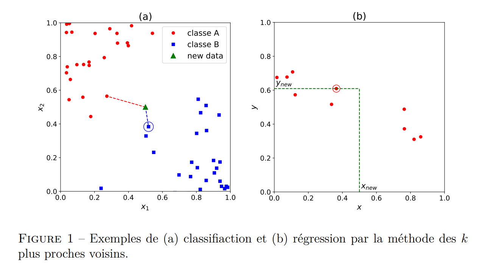

# TP1 : Algorithme des k plus proches voisins et méthode de validation croisée

## 1) Algorithme des k plus proches voisins

Soit un set de donnée d'apprentissage $D = {x^{(i)}, y^{(i)}}_{1}$, on supposera pour cet algorithme que 
l'on peut prédire l'étiquette y associée à un point x en prenant la valeur de son plus proche voisin $x^{(k)}$.

On définira la distance entre deux points $x^{(i)}$ et $x^{(j)}$ par la distance euclidienne :

$$d(x^{(i)}, x^{(j)}) = \sqrt{\sum_{k=1}^{d}(x^{(i)}_{k} - x^{(j)}_{k})^{2}}$$

